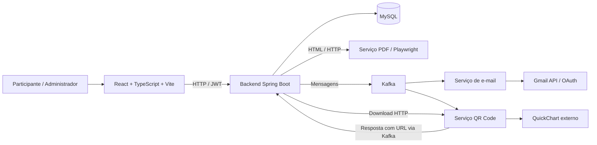

# Muttley — análise para a pré-banca

Data: 02/09/2026. Escopo: os seis repositórios presentes no workspace.

## 1. Parecer

O Muttley tem uma base de implementação suficiente para sustentar uma boa pré-banca: gestão de eventos, inscrição pública, controle de presença, geração de certificados, consulta individual, medalhas e serviços auxiliares. Os cinco projetos de aplicação compilam. A estrutura do backend por domínio e os documentos de requisitos são bons pontos de partida.

A prioridade agora é tornar confiável a jornada **evento → inscrição → presença → certificado → validação pública** e demonstrar por que ela resolve um problema acadêmico concreto. Há falhas de autorização e inconsistências que afetam justamente essa jornada. Acrescentar funcionalidades ou refazer a aparência inteira neste momento dispersaria o esforço.

A avaliação acadêmica depende também de materiais que não encontrei neste workspace: texto do TCC, problema de pesquisa sustentado por evidências, levantamento com usuários, comparação de alternativas e resultados de validação. Eles podem existir fora do projeto; sua ausência aqui não significa que nunca foram produzidos.

Não atribuo uma porcentagem de conclusão: não foram informados o escopo aprovado, a data da pré-banca ou a rubrica da instituição.

## 2. O que foi verificado

Foram analisados arquitetura, configuração, rotas, autenticação, regras centrais, entidades, consultas, DTOs, comunicação entre serviços, telas, componentes, documentação e configuração de testes. O backend principal contém 121 arquivos Java de produção, 14 entidades e 14 controllers.

| Verificação | Resultado | Limite da evidência |
|---|---|---|
| Backend, PDF, QR Code e e-mail: `mvn -o -DskipTests clean package`, usando o cache Maven local | Os quatro passaram | Compilação e empacotamento; testes de aplicação não executados |
| Frontend: instalação pelo `package-lock.json` e `npm run build` | Passou | Não comprova comunicação com serviços reais |
| Frontend: ESLint com a configuração do projeto | 54 erros e 1 aviso; 24 arquivos com erros | São problemas de qualidade/configuração, não 54 defeitos funcionais comprovados |
| Navegador Chromium, frontend compilado e respostas HTTP simuladas | Reproduzidos redirecionamento do certificado, inscrição habilitada em evento cancelado e erros de datas | Isola o frontend; não é teste ponta a ponta com backend real |
| Lista pública em 1366px e 390px | Layout utilizável; sem overflow horizontal em 390px | Apenas os cenários inspecionados; não é auditoria completa de acessibilidade |
| Métodos reais de cadastro e participação, com repositórios em memória | Reproduzidas quatro falhas descritas abaixo | Não executa filtros HTTP, banco, Bean Validation ou Kafka |
| Docker Compose | Configuração declara apenas Kafka e ZooKeeper | A consulta ao daemon foi bloqueada pelo ambiente; não validei os containers em execução |
| Testes existentes | Três métodos `contextLoads()`; nenhum teste no serviço de e-mail; nenhum script de teste no frontend | O guia existente descreve testes a implementar |

As primeiras tentativas de build encontraram dependências ausentes/inacessíveis no ambiente de execução. Após usar o cache Maven disponível e instalar as dependências do frontend, todos os builds passaram. Essas limitações iniciais não foram classificadas como defeitos do Muttley.

Não foram iniciados o backend principal nem consumidores de e-mail contra dados reais. Não foram enviados e-mails nem alterados registros do banco. O código da aplicação permaneceu inalterado; os novos arquivos documentam esta análise e suas evidências.

Evidências: [navegador](evidencias-pre-banca/browser-report.json), [regras isoladas](evidencias-pre-banca/backend-isolado.txt), [lint](evidencias-pre-banca/eslint-report.json). Os scripts usados estão na mesma pasta; seus caminhos de ferramentas refletem esta máquina.

## 3. Arquitetura e funcionalidades existentes

Java 21 é o alvo de compilação. O backend usa Spring Boot 4.0.5 e os serviços usam 4.0.6. O frontend declara React 19, TypeScript 6 e Vite 8. A existência de versões diferentes de patch não é, por si só, um defeito.

| Área | O que existe | Preparação necessária |
|---|---|---|
| Identidade | Cadastro, login, BCrypt, JWT e perfis ADMIN/USER | Corrigir cadastro público, ativação e preservação de perfil |
| Eventos | CRUD, estados, filtros e participantes | Alinhar edição, remoção de participantes e validações |
| Participação | Inscrição pública, reaproveitamento de pessoa e confirmação | Validar identidade, janela de presença e unicidade |
| Certificação | Emissão para presentes, UUID, PDF, assinatura visual e página pública | Corrigir consulta anônima, dados públicos, datas e verificação no PDF |
| Área pessoal | `/api/me`, participações, certificados e medalhas | Preservar isolamento e cobrir com testes |
| Administração | Painel, certificados, medalhas, locais, endereços, disciplinas e consulta de pessoas | Completar o caminho de cadastros necessários à criação de eventos |
| Integrações | Kafka, Gmail, PDF e URLs de QR Code | Preparação reproduzível, tratamento de falhas e teste integrado |
| Documentação | Requisitos, regras, DER, diagramas de classes/casos de uso e guia de testes | Atualizar diagramas e criar rastreabilidade com evidências |

O arquivo `mockDb.ts` chama a API real: apesar do nome, não é um banco fictício. Renomeá-lo posteriormente para refletir essa responsabilidade melhora a compreensão. O backend concentra o domínio; os demais serviços têm responsabilidades auxiliares. Explique essa distribuição na banca sem afirmar escalabilidade ou alta disponibilidade ainda não medidas.

## 4. Correções prioritárias

P0: resolver antes de disponibilizar o sistema a outras pessoas ou usar dados reais. P1: resolver antes do ensaio final da demonstração. P2: planejar para a entrega final, salvo se fizer parte do escopo obrigatório.

### P0 — cadastro, autorização e dados

**1. Cadastro público pode atualizar uma pessoa existente.** `AuthController.cadastrarUsuario` aceita `AtualizacaoPessoa`, que contém `id`, e chama o serviço de criação/atualização. Com ID existente e outro e-mail ainda não cadastrado, o serviço atualiza nome, contato e senha da pessoa indicada. A verificação isolada retornou 201 e confirmou a substituição de e-mail e senha. A rota está liberada publicamente em `SecurityConfig`.

Correção: criar DTO exclusivo para cadastro, sem ID; separar criação de atualização; nunca permitir que o cadastro público selecione uma pessoa existente por ID. Critério: enviar ID não pode alterar qualquer usuário existente. Evidência: [AuthController:58](C:/Users/andre/Documents/TCC/muttley/Backend-Muttley/src/main/java/com/fatec/muttley/auth/AuthController.java:58) e [PessoaService:23](C:/Users/andre/Documents/TCC/muttley/Backend-Muttley/src/main/java/com/fatec/muttley/pessoa/PessoaService.java:23).

**2. Completar cadastro não exige prova de posse do e-mail.** O PUT público busca a pessoa pelo e-mail e permite definir senha quando ela ainda não existe. O ID ofuscado no link não é validado como autorização nessa operação. O teste isolado confirmou que a senha é definida sem token de ativação.

Correção: token aleatório de uso único, vinculado à pessoa, com prazo e consumo após a ativação. Nome/CPF conhecidos não substituem essa prova. Como referência para o desenho de tokens, a OWASP recomenda expiração, vínculo ao usuário e uso único em fluxos de recuperação; esses princípios também são pertinentes à ativação proposta. [OWASP](https://cheatsheetseries.owasp.org/cheatsheets/Forgot_Password_Cheat_Sheet.html)

**3. Inscrição pública rebaixa ADMIN para USER.** `resolverPessoa` executa `pessoa.setRole(Role.USER)` também para pessoas existentes. Reproduzido em memória. O token já emitido pode manter a role antiga até expirar; em novo login a alteração aparece.

Correção: definir USER somente na criação de pessoa e preservar o perfil existente. Critério: inscrever administrador não muda sua permissão. Evidência: [ParticipacaoService:134](C:/Users/andre/Documents/TCC/muttley/Backend-Muttley/src/main/java/com/fatec/muttley/participacao/ParticipacaoService.java:134).

**4. Qualquer usuário autenticado alcança o CRUD de participações.** `/api/participacoes` aceita leitura, criação, atualização e exclusão sem verificação de proprietário ou role no controller/service. A regra genérica exige apenas autenticação.

Correção: operações administrativas restritas a ADMIN; usuário consulta suas participações por `/api/me/participacoes`; se houver cancelamento individual, verificar vínculo ao usuário. Testar visitante, USER, dono do registro, outro USER e ADMIN. A autorização deve ser verificada no servidor em cada operação e objeto relevante. [OWASP](https://cheatsheetseries.owasp.org/cheatsheets/Authorization_Cheat_Sheet.html)

**5. Confirmação de presença aceita evento cancelado e não verifica o momento do evento.** O serviço verifica pessoa, inscrição e duplicidade, mas não estado/data/horário. O teste isolado marcou presença em evento CANCELADO. A rota pública recebe somente evento e CPF; um link compartilhado não comprova presença física.

Correção: definir com o orientador a política de check-in — janela de horário, evento ativo, token temporário do evento e/ou conferência do organizador. Registrar horário e responsável/origem. Colocar o CPF no corpo da requisição reduz sua exposição em URLs e logs. Critério: presença antes/depois da janela e em evento cancelado/finalizado é rejeitada conforme a regra aprovada.

**6. Minimizar dados públicos e retirar segredos de configuração.** A consulta pública retorna a entidade `Certificado` com `Participacao` e `Pessoa`; CPF, telefone e e-mail não têm a mesma proteção da senha. Use DTO público limitado a nome, evento, carga horária, emissão, código e situação. A consulta administrativa de pessoa usa DTO com campo senha, e o mapper copia o hash: remova-o também das respostas administrativas.

`Infra-Muttley/credentials.json` está versionado e contém configuração OAuth com `client_secret`; não foi verificado se está ativo ou se o repositório é público. A configuração JWT permite variável de ambiente, mas tem valor literal de fallback; Hashids tem segredo literal. O inicializador cria administrador com senha fixa e sem restrição de perfil de ambiente. Externalizar configuração, restringir seed a `demo/dev`, proteger arquivos OAuth/tokens e avaliar substituição das credenciais expostas. Um client secret de aplicativo desktop não deve ser confundido com um access token; nenhum valor foi reproduzido neste relatório.

### P1 — o que pode comprometer a apresentação

| Problema observado | Consequência | Correção e critério de aceite |
|---|---|---|
| Página pública do certificado chama `getParticipationById`, que exige sessão | Visitante é redirecionado para login; reproduzido no navegador | DTO público deve fornecer os dados necessários; abrir certificado em aba anônima sem redirecionamento |
| Datas tratadas com `new Date('YYYY-MM-DD')`; alguns cartões somam 1 ao dia | Em São Paulo, 01/09/2026 apareceu como 31/08/2026 e 32/08 | Centralizar tratamento de datas sem horário; testar primeiro/último dia do mês e diferentes fusos |
| “Assinatura Digital (Hash)” mostra texto de coordenação | Apresentação comunica uma garantia criptográfica que o código não implementa | Usar “Responsável pela emissão” e “Assinatura visual”; explicar que UUID identifica o registro |
| PDF não imprime código de validação nem URL pública no template utilizado | Arquivo baixado fica sem caminho explícito para conferir o registro | Adicionar código, endereço de consulta e, se viável, QR de validação no próprio PDF |
| Front pede `/api/certificados/{id}/assinatura-visual`; controller público atende `/{id}/assinatura-visual` | Imagem da assinatura da página falha e é escondida | Unificar contrato, preferindo código público e escopo do certificado; testar URL e MIME |
| Edição do evento valida ID da URL, mas salva usando ID do corpo | Pode criar outro evento ou editar o registro errado | Aplicar `dto.evento().withId(id)` ou rejeitar divergência; testar corpo sem ID e ID divergente |
| “Remover” participante só altera a lista no React; atualização do backend apenas salva os enviados | Pessoa removida pode reaparecer ao recarregar | Definir operação explícita de remoção e regras para quem já tem certificado |
| Desmarcar presença na conclusão não desfaz presença já gravada | Tela indica ausente, mas backend ainda gera certificado | Definir lista autoritativa ou impedir desmarcação; testar pessoa previamente presente |
| Modalidade HÍBRIDO é oferecida, mas convertida para ONLINE ao salvar | Informação é perdida silenciosamente | Implementar a modalidade em todo o contrato ou retirar a opção |
| Local, disciplina e patrocinador obrigatórios não estão claramente indicados no formulário | Criação falha após preencher campos aparentemente opcionais | Alinhar rótulos, validação e decisões do domínio |
| Patrocinador é obrigatório, mas não há tela de cadastro nem seed correspondente | Ambiente vazio não permite concluir a criação do primeiro evento apenas pela interface | Disponibilizar cadastro, tornar opcional por regra aprovada ou incluir dados de demonstração |
| Tela “Pessoas” lista apenas perfis especializados | Pessoa criada por cadastro/inscrição comum pode não aparecer em nenhuma aba | Adicionar “Todas as pessoas” e distinguir cadastro de pessoa, perfil e papel no evento |
| Backend retorna `erro`/`erros`; interceptor procura `error`/`errors` | Validação chega ao usuário como erro genérico | Padronizar resposta e manter status/campos na camada de API |
| Regras de estado lançam exceções sem mapeamento; conclusão captura tudo como 500 | Erro de uso é apresentado como falha do servidor | Respostas 400/404/409 coerentes e mensagem de correção |
| Evento futuro cancelado recebe `inscricoesEncerradas=false` | Interface ainda habilita inscrição; reproduzido, embora backend rejeite | Considerar também status na disponibilidade de inscrição |

Fontes principais: [CertificateView](C:/Users/andre/Documents/TCC/muttley/front-muttley/src/pages/public/CertificateView.tsx:36), [interceptor](C:/Users/andre/Documents/TCC/muttley/front-muttley/src/services/apiClient.ts:35), [EventoController](C:/Users/andre/Documents/TCC/muttley/Backend-Muttley/src/main/java/com/fatec/muttley/evento/EventoController.java:157), [EventForm](C:/Users/andre/Documents/TCC/muttley/front-muttley/src/pages/admin/EventForm.tsx:216), [EventConclude](C:/Users/andre/Documents/TCC/muttley/front-muttley/src/pages/admin/EventConclude.tsx:115), [adapter de API](C:/Users/andre/Documents/TCC/muttley/front-muttley/src/data/mockDb.ts:520), [template PDF](C:/Users/andre/Documents/TCC/muttley/Backend-Muttley/src/main/resources/templates/public/certificados/modeloPdf.html:1).

### P1 — preparar execução e integrações

**Inicialização reproduzível.** O Compose contém apenas Kafka/ZooKeeper. Documentar MySQL, quatro aplicações Java, frontend, Chromium do Playwright, variáveis, portas, volumes e ordem de inicialização. Um Compose completo é útil se couber no prazo; um procedimento testado e um script de preparação também atendem à demonstração. Não trocar a arquitetura inteira às vésperas da banca.

**QR Code e acesso pelo celular.** A URL configurada é `http://localhost:5173`. No celular, `localhost` aponta para o celular. Usar endereço acessível pelo dispositivo, ajustar o frontend e ensaiar na rede escolhida. O serviço de QR monta uma URL QuickChart e baixa a imagem externamente; não gera a imagem localmente. Pré-gerar imagens ou adotar geração local se a demonstração precisar funcionar sem internet.

**PDF.** O fragmento HTML fixa `http://localhost:8083/` como base para CSS e fundo. Em containers separados esse endereço não aponta para o backend. Preferir recursos embutidos ou endereço configurável. Conferir orientação A4, margens, textos longos, acentos e assinatura; o CSS pede paisagem e o serviço define formato/margens próprios. O PDF real não foi inspecionado nesta revisão.

O serviço mantém uma instância compartilhada de Playwright/Browser sem sincronização. Isso é um risco concreto para requisições simultâneas, a validar com duas gerações concorrentes: a API Java exige acesso pela mesma thread ou sincronização adequada. Usar executor dedicado ou instâncias controladas. [Documentação Playwright](https://playwright.dev/java/docs/multithreading)

**E-mail.** `GmailService` procura `classpath:credentials.json`, mas o arquivo encontrado está no repositório Infra. Além disso, `ResourceUtils.getFile` depende de arquivo físico e merece ajuste para execução por JAR. Preparar autenticação antes do ensaio; não depender de uma autorização OAuth interativa na apresentação. O certificado é enviado por **link**, não como PDF anexado: a rotina de anexo existe, mas não é chamada nesse fluxo.

`EmailService.enviar` captura falha e apenas registra log; o listener retorna normalmente. Assim, a falha de envio não chega ao tratamento de erro do Kafka. Publicações também não acompanham o resultado assíncrono. Implementar registro de estado, retentativa e encaminhamento de falhas; o Spring Kafka fornece mecanismos para isso. [Documentação Spring Kafka](https://docs.spring.io/spring-kafka/reference/kafka/annotation-error-handling.html)

**Preparação de segurança dos serviços auxiliares.** O endpoint de download de QR aceita URL arbitrária e abre seu conteúdo; restringir esquema/host ou substituir por geração interna. Não expor livremente esse endpoint nem o renderizador de HTML/PDF. Validar arquivos de assinatura por conteúdo, tamanho e tipo, gerar nome próprio e manter arquivos em diretório controlado. A aplicação não define validação própria de upload; eventuais limites padrão do framework não substituem essa regra.

## 5. Melhorias para a entrega final

| Área | Recomendação | Por que importa |
|---|---|---|
| Banco | Migrações versionadas e política de backup/restauração | `ddl-auto=update` não registra a evolução do schema |
| Integridade | Unicidade de CPF normalizado, pessoa/evento e certificado/participação | Verificar antes de salvar não impede duplicidade simultânea |
| Inscrição | Substituir `max(inscricao)+1` e geração de números no navegador | Evita colisões e múltiplas fontes da mesma regra |
| Lotação | Definir capacidade/vagas e atualização concorrente | Capacidade do local está armazenada, mas não limita inscrições |
| Estados | Centralizar transições e tratar tempo de forma testável | Status muda durante consultas; filtros podem selecionar antes da atualização |
| Transações | Criar/editar evento e participantes em uma unidade de negócio | Hoje é possível persistir parcialmente antes de outra etapa falhar |
| Mensageria | Coordenar commit e publicação; considerar outbox se confiabilidade for requisito | Transação do banco não inclui automaticamente arquivo, Kafka e Gmail |
| Certificados | Preservar dados emitidos e definir revogação/reemissão | PDF é regenerado com dados atuais; alterações posteriores podem mudar o documento |
| Contratos | DTOs dedicados e documentação de API | Evita expor grafo JPA e misturar modelos de escrita/leitura |
| Tipagem | Eliminar `any` gradualmente e alinhar enums | “Participante” do backend não está no union de papéis do frontend |
| Frontend | Usar role do servidor em `normalizePerson` | Há regra legada que infere ADMIN por um CPF fixo; não é a autorização do servidor |
| Navegação | Guardas uniformes, sessão expirada e tela 403 | Layout administrativo é escolhido pelo caminho; a API continua responsável pela proteção |
| Desempenho | Paginação real e endpoint agregado do painel | Front busca até 1000 eventos e várias listas completas para agregar localmente |
| Painel | Unificar definição dos indicadores | `/api/admin/inicio` existe, mas a tela calcula outros indicadores por múltiplas chamadas |
| Manutenção | Dividir CSS e reduzir duplicação/código morto | CSS central tem 5951 linhas; `EventForm` contém bloco desativado por `false &&` |
| CI | Executar build, lint e testes em cada alteração | Evidência reproduzível de qualidade para orientador e banca |

Não é necessário adotar Kubernetes, mais microsserviços ou novos recursos de gamificação para resolver os problemas encontrados.

## 6. Aparência e experiência de uso

A identidade vermelha, a separação entre área pública e administrativa, os componentes de feedback e a navegação móvel já oferecem uma apresentação coerente. Na lista pública inspecionada, conteúdo, busca e ação principal permaneceram legíveis em 390px. Há suporte de teclado no autocomplete, estilos de foco e região de anúncios para mensagens.

Na conclusão administrativa em 1366px, o título está desproporcional ao conteúdo, a margem esquerda é muito pequena e o aviso “Somente presentes receberão certificado” encosta/sobrepõe a linha de status. Padronizar títulos, espaçamento e disposição dos cards é mais importante que redesenhar todas as telas. Conferir nomes longos, tabelas e botões com zoom de 125% na resolução do projetor.

Também recomendo: acentuação consistente, indicação explícita de campos obrigatórios, estado persistente de sucesso na inscrição, nome/data do evento na confirmação de presença e tratamento de falha do PDF dentro da própria página. Avaliar foco e fechamento dos modais e os rótulos acessíveis do autocomplete. Não houve medição suficiente para declarar conformidade de acessibilidade.

Capturas com dados fictícios e fontes externas bloqueadas: [lista desktop](evidencias-pre-banca/public-desktop.png), [lista mobile](evidencias-pre-banca/public-mobile.png), [conclusão](evidencias-pre-banca/conclude-desktop.png), [cartão com data incorreta](evidencias-pre-banca/certificates-desktop.png).

## 7. Preparação acadêmica

O sistema precisa ser acompanhado por uma argumentação que o avaliador consiga relacionar às funcionalidades demonstradas.

**Os diagramas já existem, mas precisam de revisão antes dos slides.** Foram inspecionadas as três imagens em `docs`:

| Artefato | Divergência observada | Atualização recomendada |
|---|---|---|
| [erd.png](C:/Users/andre/Documents/TCC/muttley/Backend-Muttley/docs/erd.png) | Ainda usa `AULA_ABERTA`, liga certificado/medalha ao aluno e não representa o modelo atual com Pessoa e Participação | Atualizar a partir das 14 entidades atuais, incluindo chaves e cardinalidades reais |
| [Muttley-Class-Diagram.png](C:/Users/andre/Documents/TCC/muttley/Backend-Muttley/docs/Muttley-Class-Diagram.png) | Certificado contém `dataExpiracao` e `idCredencial`, enquanto o código usa UUID e outros campos; participação não mostra presença | Alinhar atributos e opcionalidades; distinguir modelo conceitual de modelo implementado |
| [Muttley-Use-Case.png](C:/Users/andre/Documents/TCC/muttley/Backend-Muttley/docs/Muttley-Use-Case.png) | Separa Admin e Coordenador de Curso, mas a autorização implementada tem ADMIN/USER; não explicita visitante, inscrição pública e validação pública | Mapear papéis do domínio para permissões e acrescentar os casos centrais da jornada |

Essas figuras são material reaproveitável. Apresentá-las sem atualização pode gerar perguntas sobre divergências entre modelagem e demonstração.

| Material | O que preparar |
|---|---|
| Problema e contexto | Descrever como um evento é organizado hoje na instituição, onde ocorrem retrabalho e dificuldades, com entrevistas, observação ou registros autorizados |
| Pergunta orientadora | Exemplo a validar: “Como integrar inscrição, confirmação de presença e emissão verificável de certificados em eventos acadêmicos?” |
| Objetivo geral | Desenvolver e avaliar uma aplicação web para integrar essas etapas no contexto delimitado |
| Objetivos específicos | Levantar requisitos; modelar dados e fluxos; implementar; testar; avaliar com usuários representativos |
| Justificativa | Relacionar cada problema observado à solução; não inventar economia de tempo ou redução de erros |
| Escopo | Distinguir entrega central, recursos complementares e trabalho futuro; tratar medalhas como complemento se não forem a contribuição principal |
| Trabalhos relacionados | Comparar soluções reais com os mesmos critérios: inscrição, check-in, certificado verificável, adequação institucional e operação |
| Método | Explicar coleta dos requisitos, decisões de projeto, desenvolvimento e protocolo de avaliação; nomear o método acadêmico em acordo com o orientador |
| Modelagem | Diagrama de contexto/containers, DER completo, casos de uso e sequência da conclusão do evento |
| Validação | Matriz requisito → regra → implementação → teste → resultado; protocolo de tarefas com participantes representativos |
| Resultados e limites | Exibir o que foi efetivamente medido; separar implementado, testado, observado em usuários e planejado |
| Cronograma | Entregas verificáveis até a banca final, com margem para correções e ensaios |

Os requisitos atuais têm IDs e regras bem detalhadas. Entretanto, alguns registram a implementação atual, inclusive decisões frágeis, como primeiro cadastro administrativo e participação acessível por qualquer autenticado. Revalidá-los com o domínio; “está no documento” não basta para justificar a regra.

Não encontrei requisitos não funcionais mensuráveis. Definir metas de tempo de emissão, quantidade de participantes, comportamento em falha e facilidade de uso, com máquina e condições de medição declaradas. Exemplos de medidas úteis são tempo para organizar um evento, tempo da conclusão até disponibilizar certificados, taxa de sucesso das tarefas e quantidade de intervenções manuais. Antes de medir, registrar protocolo e tamanho da amostra; não apresentar metas como resultados.

## 8. Ordem recomendada de trabalho

1. Fechar o escopo da pré-banca e registrar o fluxo mínimo no [roteiro](roteiro-pre-banca.md).
2. Corrigir P0 de cadastro, ativação, permissões e presença; criar regressões desses casos.
3. Corrigir certificado público, datas e coerência entre seleção e persistência.
4. Preparar dados fictícios e inicialização reproduzível, incluindo patrocinador, local e disciplina.
5. Ensaiar a jornada integrada, incluindo download e consulta anônima, com serviços reais preparados.
6. Consolidar texto, diagramas, evidências, limitações e cronograma; ajustar telas que aparecem no ensaio.

Critério de prontidão: conseguir iniciar o ambiente de forma documentada e repetir duas vezes a demonstração completa, mantendo os dados consistentes, comprovando os controles de acesso e abrindo um certificado fora da sessão do participante. O roteiro complementar detalha os testes, os slides e o plano de contingência.
