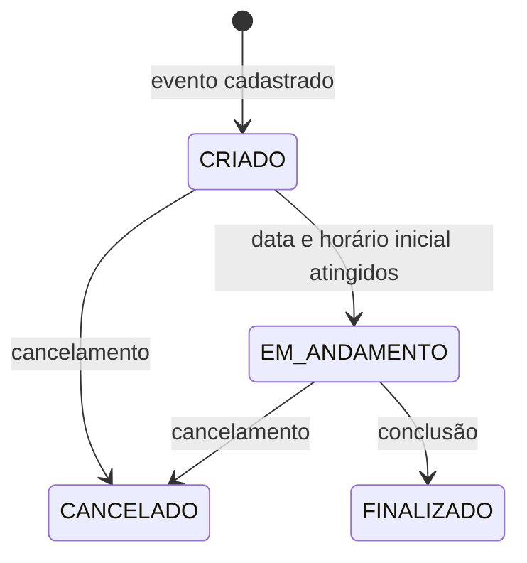
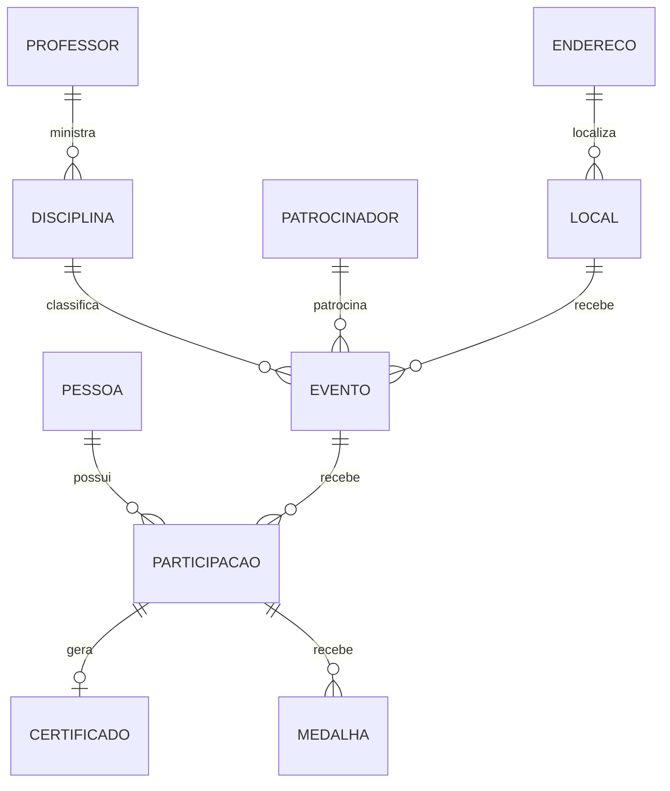

# Muttley - Requisitos e Regras de Negócio

## 1. Sobre o sistema

O Muttley é uma plataforma para gestão de eventos acadêmicos da FATEC. O sistema permite:

- divulgar eventos e receber inscrições públicas;
- administrar eventos, participantes e presença;
- emitir certificados;
- conceder medalhas;
- enviar notificações por email;
- gerar QR Codes de inscrição e confirmação de presença;
- disponibilizar uma área pessoal para cada usuário.

Para validar os requisitos, consulte o [guia de testes](../testes/README.md) e a [matriz de rastreabilidade](../testes/matriz-requisitos-testes.csv). O fluxo de ativação de conta está detalhado em [cadastro por convite](cadastro.md).

## 2. Perfis de acesso

### Visitante

Não precisa estar autenticado. Pode:

- consultar eventos disponíveis;
- visualizar detalhes de um evento;
- realizar uma inscrição;
- confirmar presença;
- consultar, visualizar e baixar certificados públicos.

### Usuário

Possui a role `USER`. Além das ações públicas, pode:

- consultar seus dados;
- consultar suas participações;
- administrar somente suas próprias participações;
- consultar seus certificados;
- consultar suas medalhas.

### Administrador

Possui a role `ADMIN`. Pode:

- acessar o painel administrativo;
- gerenciar eventos e participações;
- gerenciar pessoas e cadastros auxiliares;
- concluir e cancelar eventos;
- emitir certificados;
- conceder medalhas;
- consultar estatísticas.

## 3. Controle de acesso

| Recurso | Visitante | USER | ADMIN |
|---|:---:|:---:|:---:|
| Cadastro e login | Sim | Sim | Sim |
| Consulta pública de eventos | Sim | Sim | Sim |
| Inscrição em evento | Sim | Sim | Sim |
| Confirmação de presença | Sim | Sim | Sim |
| Consulta pública de certificado | Sim | Sim | Sim |
| Área `/api/me/**` | Não | Sim | Sim |
| Recursos `/api/admin/**` | Não | Não | Sim |
| Recursos autenticados restantes | Não | Sim | Sim |

Todas as sessões são stateless. A autenticação utiliza Bearer Token JWT.

Em `/api/participacoes/**`, USER lista, consulta, cria, altera e exclui somente participações próprias; ADMIN pode administrar as demais. Informar o ID de outra pessoa no corpo não concede acesso.

## 4. Pessoas e autenticação

### Requisitos funcionais

- **RF-AUT-01:** solicitar cadastro com nome e email e concluir os dados e a senha por convite de uso único.
- **RF-AUT-02:** autenticar usuário por email e senha.
- **RF-AUT-03:** emitir JWT após autenticação válida.
- **RF-AUT-04:** permitir que uma pessoa criada durante uma inscrição complete seu cadastro.
- **RF-AUT-05:** permitir ao usuário consultar seus próprios dados.
- **RF-PES-01:** permitir ao administrador listar, consultar, criar, atualizar e excluir pessoas.
- **RF-PES-02:** permitir ao administrador listar pessoas por perfil.

### Regras de negócio

- **RN-AUT-01:** o email deve ser único.
- **RN-AUT-02:** a senha deve ser armazenada com BCrypt.
- **RN-AUT-03:** a senha nunca deve ser retornada pela API.
- **RN-AUT-04:** o administrador inicial é criado pelo bootstrap configurado; o cadastro público nunca concede `ADMIN`.
- **RN-AUT-05:** contas criadas pelo cadastro público recebem role `USER`.
- **RN-AUT-06:** credenciais inválidas retornam `401 Unauthorized`.
- **RN-AUT-07:** o JWT deve conter email, ID do usuário, role, emissão e expiração.
- **RN-AUT-08:** a duração padrão do JWT é de duas horas.
- **RN-AUT-09:** um cadastro incompleto só pode ser completado uma vez.
- **RN-AUT-10:** convite inválido, expirado ou já consumido retorna `404 Not Found`.

Solicitar cadastro retorna `202` sem indicar se o email já existe. A conclusão exige o convite aleatório enviado ao email, válido por 24 horas e armazenado apenas como hash. CPF e email devem corresponder à pessoa vinculada. A verificação geral de email como estado próprio da conta continua futura; o convite de ativação já é exigido.

- **RN-PES-01:** cadastro completo exige nome, email válido, telefone, CPF válido e senha.
- **RN-PES-02:** uma pessoa pode possuir perfis especializados de aluno, professor, palestrante, organizador ou colaborador.

### Dados do usuário autenticado

| Rota | Descrição |
|---|---|
| `GET /api/me` | Dados pessoais do usuário autenticado. |
| `GET /api/me/participacoes` | Participações vinculadas ao usuário. |
| `GET /api/me/certificados` | Certificados vinculados ao usuário. |
| `GET /api/me/medalhas` | Medalhas vinculadas ao usuário. |

## 5. Eventos

### Requisitos funcionais

- **RF-EVT-01:** listar eventos disponíveis para inscrição.
- **RF-EVT-02:** exibir detalhes públicos do evento.
- **RF-EVT-03:** permitir ao administrador criar eventos.
- **RF-EVT-04:** permitir ao administrador atualizar eventos.
- **RF-EVT-05:** permitir ao administrador cancelar eventos.
- **RF-EVT-06:** permitir ao administrador concluir eventos.
- **RF-EVT-07:** listar eventos administrativos com busca, filtro, ordenação e paginação.
- **RF-EVT-08:** consultar as participações de um evento.
- **RF-EVT-09:** gerar e baixar QR Codes de inscrição e confirmação.

### Dados obrigatórios

Um evento deve possuir:

- tema;
- descrição;
- data;
- horário inicial;
- horário final;
- modalidade;
- disciplina;
- patrocinador;
- local.

### Estados do evento



### Regras de negócio

- **RN-EVT-01:** todo evento novo inicia como `CRIADO`.
- **RN-EVT-02:** a data informada não pode estar no passado.
- **RN-EVT-03:** horários devem utilizar o formato `HH:mm`.
- **RN-EVT-04:** o horário final deve ser posterior ao horário inicial.
- **RN-EVT-05:** disciplina, patrocinador e local devem existir.
- **RN-EVT-06:** evento `FINALIZADO` ou `CANCELADO` não pode ser atualizado. Em atualizações permitidas, o ID da URL identifica o evento, prevalece sobre o corpo e não é alterado.
- **RN-EVT-07:** evento `FINALIZADO` não pode ser cancelado.
- **RN-EVT-08:** evento `CANCELADO` não pode ser cancelado novamente.
- **RN-EVT-09:** somente evento `EM_ANDAMENTO` pode ser concluído.
- **RN-EVT-10:** evento `CRIADO` passa para `EM_ANDAMENTO` após atingir sua data e horário inicial.
- **RN-EVT-11:** somente eventos `CRIADO` são exibidos como disponíveis para inscrição.
- **RN-EVT-12:** eventos cancelados não aparecem na listagem administrativa padrão.
- **RN-EVT-13:** cancelamento envia notificação a todos os inscritos.
- **RN-EVT-14:** criação solicita a geração dos QR Codes de inscrição e confirmação.

### Conclusão do evento

A conclusão utiliza:

```http
POST /api/admin/eventos/{id}/concluir
Content-Type: multipart/form-data
```

Parâmetros:

| Campo | Obrigatório | Descrição |
|---|:---:|---|
| `file` | Sim | Imagem da assinatura usada nos certificados. |
| `presentes` | Não | IDs das participações presentes. |

Ao concluir um evento, o sistema deve:

1. validar que o evento está `EM_ANDAMENTO`;
2. salvar a imagem da assinatura;
3. marcar as participações válidas como presentes;
4. gerar medalhas de bronze para os presentes;
5. gerar certificados para os presentes ainda não certificados;
6. alterar o evento para `FINALIZADO`;
7. notificar os inscritos sobre a conclusão;
8. enviar os certificados recém-gerados por email.

IDs de participação que não pertencem ao evento são ignorados.
Assinaturas devem ser imagens PNG ou JPEG válidas (`.png`, `.jpg` ou `.jpeg`), com extensão, MIME e conteúdo coerentes.

## 6. Inscrições e participações

### Requisitos funcionais

- **RF-PAR-01:** permitir inscrição pública sem autenticação.
- **RF-PAR-02:** receber nome completo, CPF e email na inscrição.
- **RF-PAR-03:** permitir consulta das participações do usuário autenticado.
- **RF-PAR-04:** permitir confirmação pública de presença.
- **RF-PAR-05:** permitir gestão autenticada de participações; USER administra somente as próprias e ADMIN pode administrar todas.

### Regras de negócio

- **RN-PAR-01:** inscrição só é permitida em evento `CRIADO` e ainda não iniciado.
- **RN-PAR-02:** o sistema deve procurar uma pessoa existente por CPF e email.
- **RN-PAR-03:** uma pessoa existente deve ser reutilizada.
- **RN-PAR-04:** se CPF e email pertencerem a pessoas diferentes, retornar `409 Conflict`.
- **RN-PAR-05:** uma pessoa não pode se inscrever duas vezes no mesmo evento.
- **RN-PAR-06:** pessoa criada pela inscrição recebe role `USER`.
- **RN-PAR-07:** os campos não informados da pessoa podem permanecer nulos.
- **RN-PAR-08:** o número da inscrição é gerado sequencialmente.
- **RN-PAR-09:** o tipo padrão é `Participante`.
- **RN-PAR-10:** uma inscrição bem-sucedida envia email de confirmação.
- **RN-PAR-11:** pessoa sem senha também recebe email para completar cadastro.
- **RN-PAR-12:** uma participação deve estar vinculada a uma pessoa e a um evento.
- **RN-PAR-13:** inscrições encerram quando o total de participantes atinge a capacidade do local do evento, inclusive quando duas solicitações concorrem pela última vaga. A regra também se aplica à criação e transferência pelo CRUD autenticado.
- **RN-PAR-14:** um inscrito só pode confirmar presença entre dez minutos antes do início e dez minutos após o fim, incluindo os dois limites. Eventos cancelados ou finalizados não aceitam confirmação. O horário exato do início já encerra novas inscrições.
- **RN-PAR-15:** USER não pode acessar, criar, alterar, excluir ou transferir participações de outra pessoa. Uma presença confirmada não pode ser transferida para outro evento.

### Confirmação de presença

```http
POST /api/eventos/{eventoId}/confirmar-presenca/{cpf}
```

- o CPF deve ser válido;
- o momento deve estar dentro da janela de tolerância definida em RN-PAR-14;
- a pessoa deve existir;
- a pessoa deve estar inscrita no evento;
- a presença não pode ter sido confirmada anteriormente;
- a participação deve ser marcada como presente;
- uma medalha de bronze deve ser gerada.

Confirmação repetida retorna `409 Conflict`.

## 7. Certificados

### Requisitos funcionais

- **RF-CER-01:** gerar certificados para participantes presentes.
- **RF-CER-02:** listar certificados administrativamente.
- **RF-CER-03:** consultar certificado publicamente por código.
- **RF-CER-04:** visualizar certificado em PDF no navegador.
- **RF-CER-05:** baixar certificado em PDF.
- **RF-CER-06:** vincular assinatura a um certificado.
- **RF-CER-07:** vincular assinatura a todos os certificados de um evento.
- **RF-CER-08:** listar certificados do usuário autenticado.
- **RF-CER-09:** fornecer URL de compartilhamento no LinkedIn.

### Regras de negócio

- **RN-CER-01:** deve existir no máximo um certificado automático por participação.
- **RN-CER-02:** participação já certificada é ignorada durante geração em lote.
- **RN-CER-03:** certificado automático usa a data atual.
- **RN-CER-04:** certificado automático usa a assinatura textual `Coordenação FATEC`.
- **RN-CER-05:** cada certificado possui código UUID único.
- **RN-CER-06:** código, URL pública e caminho do PDF são preenchidos automaticamente.
- **RN-CER-07:** a data de emissão manual não pode ser futura.
- **RN-CER-08:** o preview retorna PDF com disposição `inline`.
- **RN-CER-09:** o download retorna PDF com disposição `attachment`.
- **RN-CER-10:** a assinatura visual é incorporada ao PDF.
- **RN-CER-11:** somente certificados recém-gerados são publicados para envio por email.
- **RN-CER-12:** a carga horária é calculada pela diferença entre início e fim do evento.
- **RN-CER-13:** uploads de assinatura aceitam apenas PNG e JPEG reais, não vazios, com extensão e MIME compatíveis; vale para conclusão, assinatura individual e assinatura por evento.

### Rotas públicas

| Rota | Resultado |
|---|---|
| `GET /api/certificados/{codigo}` | Dados e URL do LinkedIn. |
| `GET /api/certificados/{codigo}/preview` | PDF inline. |
| `GET /api/certificados/{codigo}/download` | Download do PDF. |

## 8. Medalhas

### Requisitos funcionais

- **RF-MED-01:** permitir ao administrador criar, consultar, atualizar e excluir medalhas.
- **RF-MED-02:** permitir ao usuário consultar suas medalhas.
- **RF-MED-03:** gerar medalha automaticamente após confirmação de presença.

### Regras de negócio

- **RN-MED-01:** medalha deve possuir nome, descrição, tipo e participação.
- **RN-MED-02:** tipos válidos são `BRONZE`, `PRATA` e `OURO`.
- **RN-MED-03:** o tipo padrão é `BRONZE`.
- **RN-MED-04:** participação precisa estar presente para receber bronze automático.
- **RN-MED-05:** não deve existir mais de uma medalha bronze automática para a mesma participação.
- **RN-MED-06:** administrador pode conceder medalhas adicionais.

## 9. Cadastros auxiliares

Os recursos abaixo são administrados por usuários `ADMIN`.

| Recurso | Dados e regras principais |
|---|---|
| Endereço | Estado, cidade, bairro, logradouro, número e complemento obrigatórios. |
| Local | Nome, descrição, capacidade e endereço existente. |
| Disciplina | Nome, descrição e turno; professor opcional, mas válido quando informado. |
| Patrocinador | Nome, CNPJ, valor, email, telefone e site. |
| Aluno | Instituição e matrícula. |
| Professor | Área de formação e titulação. |
| Palestrante | Resumo profissional, empresa e cargo. |
| Organizador | Instituição e cargo. |
| Colaborador | Função, disponibilidade e tipo. |

## 10. Integrações

### Emails

As notificações são publicadas no Kafka.

| Acontecimento | Tópico |
|---|---|
| Inscrição confirmada | `email.inscricao.confirmada` |
| Completar cadastro | `email.completar.cadastro` |
| Evento cancelado | `email.evento.cancelado` |
| Evento concluído | `email.evento.concluido` |
| Certificado emitido | `email.certificado` |

### QR Codes

- criação de evento solicita QR Codes de inscrição e confirmação;
- solicitações são publicadas em `qrcode.gerar.request`;
- respostas são consumidas de `qrcode.gerar.response`;
- resposta bem-sucedida atualiza a URL correspondente no evento;
- resposta com erro não altera o evento.

### PDF

- o HTML do certificado é processado pelo backend;
- a geração do PDF é delegada ao serviço configurado em `pdf.ms-url`;
- o serviço deve retornar os bytes do PDF.

## 11. Painel administrativo

O painel deve apresentar:

- próximos eventos ativos;
- eventos com maior número de certificados;
- participantes com maior número de medalhas;
- certificados emitidos nos últimos 30 dias;
- variação em relação aos 30 dias anteriores;
- quantidade de eventos ativos;
- quantidade de eventos ativos nos próximos sete dias.

Quando o período anterior não possui certificados:

- a variação é `100%` se o período atual possuir certificados;
- a variação é `0%` se ambos forem zero.

## 12. Respostas de erro

| Situação | Status esperado |
|---|:---:|
| Recurso inexistente | `404` |
| Dados inválidos | `400` |
| Credenciais inválidas | `401` |
| Token ausente ou inválido | `401` |
| USER acessando rota administrativa | `403` |
| Recurso duplicado ou conflito de estado | `409` |
| Falha inesperada | `500` |

Erros de validação retornam a lista dos campos inválidos na propriedade `erros`.

## 13. Decisões atualizadas e pontos restantes

Em 03/09/2026 o autor definiu a janela de presença, o limite de vagas, o acesso apenas às próprias participações, imagens JPG/PNG, verificação de email futura e bloqueio de edição de eventos cancelados. Essas decisões estão incorporadas nas regras acima.

A implementação passou a reservar números de inscrição em sequência transacional compartilhada entre eventos. Uma reserva cujo cadastro é revertido pode deixar um intervalo; o número reservado não é reutilizado. Inscrição por evento/pessoa e certificado por participação têm restrições únicas. O bronze automático possui uma chave única própria, preservando a concessão de medalhas manuais adicionais.

Ainda precisam de definição ou implementação:

1. Unicidade e normalização de CPF no banco e validação equivalente na inscrição pública.
2. Política de local/capacidade específica para eventos online, que atualmente também exigem local.
3. Limite de tamanho das assinaturas como regra de negócio; o limite HTTP configurado no Spring continua aplicável.
4. Verificação geral de email como estado próprio da conta, além do convite de ativação já implementado.
5. Regras de obrigatoriedade e domínio de campos numéricos atualmente primitivos.

As mensagens de conclusão/cancelamento são solicitadas após commit. Entrega garantida entre banco e Kafka, recuperação após queda do processo e repetição de mensagens ainda precisam de estratégia própria.

## 14. Modelo de dados resumido


